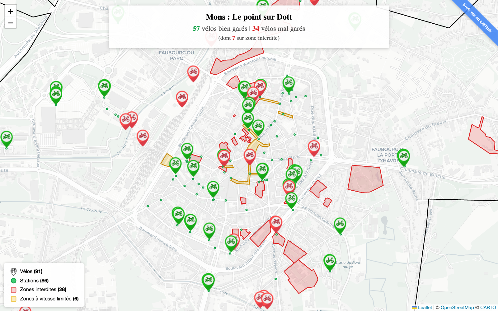

# Dott Watcher

A real-time map that tracks Dott's shared bikes across Belgian cities, flagging good and bad parking behaviour. The goal is to detect bikes that are properly parked at stations versus those left in no-ride zones or far from any docking point.

It aims to hold free-floating operators and their users accountable to city regulations, for everyone's benefit.



## What this does

- Displays every Dott bike on a Leaflet map with **green** (well-parked near a station) and **red** (badly parked) markers.
- Shows station locations and geofencing zones: no-ride areas, speed-limited zones, and the service boundary.
- Shows per-bike status: reserved, disabled, well-parked, or badly parked, plus remaining range.
- Supports multiple cities: **Mons**, **Charleroi**, **Liège**, **Brussels**.

## Why

It's an independent tool built to observe good and bad parking behaviour of free-floating micromobility services. We want to advocate for better bike usage restrictions and to make free-floating companies and their users more responsible.

Watching the data reveals how often bikes end up where they shouldn't, and that visibility encourages accountability.

## Public API

All data comes from Dott's public **GBFS v2** feeds:

```
https://gbfs.api.ridedott.com/public/v2/{city}/{feed}.json
```

Three feeds are consumed per city: `free_bike_status`, `geofencing_zones`, and `station_information`.

[GBFS specification](https://github.com/MobilityData/gbfs)

## How to change city

To add a new city, edit the `CITIES` object in `index.html`:

```js
const CITIES = {
  mons:      { name: 'Mons',      center: [50.454, 3.952], zoom: 15, boundaryName: 'Mons' },
  charleroi: { name: 'Charleroi', center: [50.411, 4.444], zoom: 13, boundaryName: 'Charleroi' },
  liege:     { name: 'Liège',     center: [50.641, 5.571], zoom: 13, boundaryName: 'Liege' },
  brussels:  { name: 'Bruxelles', center: [50.847, 4.352], zoom: 13, boundaryName: 'Brussels' },
  // add your city here
};
```

Then change the **default** city on load, edit the last line of the script:

```js
loadCity('mons');  // change to any key from CITIES
```

## Running locally

No build step — just open `index.html` in a browser.

## Contributing

Contributions are welcome:

- Additional cities or operators beyond Dott using GBFS providers.
- Historical tracking and trends.
- Better mobile layout.

Open an issue or pull request on [GitHub](https://github.com/MichaelHoste/dott-watcher).

## Disclaimer

This project is **not associated with, endorsed by, or affiliated with Dott (ridedott.com), the city of Mons, or any municipality**. It consumes public GBFS data for the purpose of observing bike parking behaviour and promoting better usage patterns.
